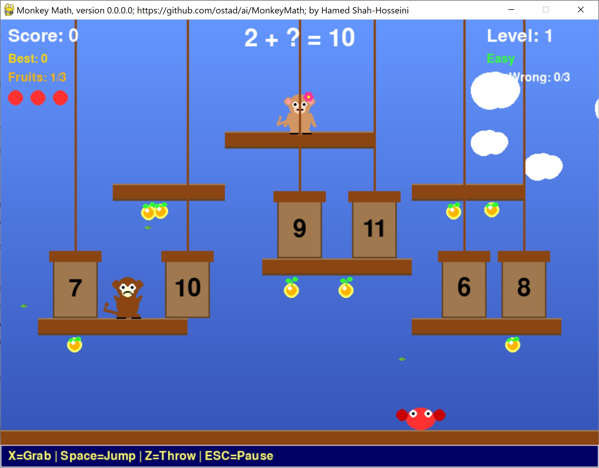
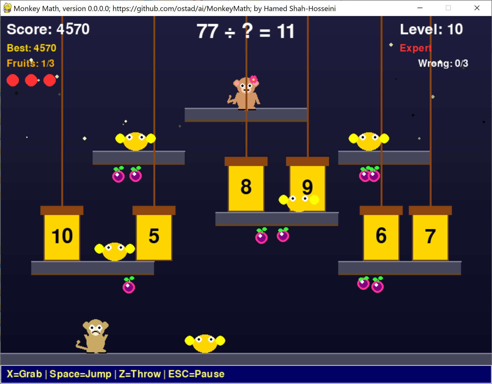

# Monkey Math
This is a fun 2D game specially for younger ones in which a **monkey** solves an arithmetic problem and should escape crabs to give the correct answer to his friend. 
 - The monkey has three lives.
 - The monkey can grab fruits by jumping.
 - The monkey can stun crabs by throwing fruit at them.
 - The monkey begins from level one, which is easy. Then, by advancing to upper levels, the number of crabs increases up to five. Moreover, the difficulty of the arithmetic problems increases from *easy* to *expert*. After level 10, the number of crabs stays five and the difficulty of arithmetic problems remains expert.
 - Also, after level 10, one of the crabs called **armored** crab is needed two fruits to be stunned.

**Hint:** The idea of this game has been taken from an old game.

Other **key points** about the game:
1. You have several keys to control the monkey:
 - Arrow keys left/right to move the monkey
 - Spacebar for jumping
 - Z for throwing fruits
 - X for choosing the answer

2. Also, we have some keys to control the game:
 - ESC to **pause** and then again **resume** the game
 - S after pressing ESC, to see the **settings** menu

3. You can let the **theme** to be automatic or fixed in the settings menu.

4. Other keys include:
 - M to toggle background ambient sound
 - N to toggle all sounds
 - R to restart the game from level one.

## This archive includes the executable program: **monkeymath.exe**, which is suitable for **Windows 10** and over. You should click on the executable to run.
[Download the archive for win64](https://drive.google.com/file/d/1FvXaWrm6FqTSYSwHE5OzstEczbmffpR0/view?usp=sharing)
---

<table>
  <tr>

<td>
Figure 1: A snapshot of MonkeyMath Game at level one, version 0.0.0.0, while playing the game.</td>
    
<td>
Figure 2: A snapshot of MonkeyMath Game at level 10, version 0.0.0.0, while playing the game.</td>

  </tr>
</table>
---
